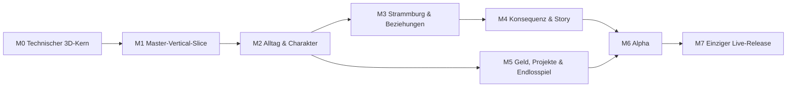

# ISSO.TV V3 / Master Edition — Produktionsroadmap

Stand: 20.08.2026

Aktiver Branch: `master`

Verifizierte Runtime-Basis: lokaler V5-Master-Arbeitsstand; die Abschlussprüfung und der lokale Master-Commit sind Bestandteil dieses Arbeitspakets.

Freigabe: **nur lokal; kein Deploy**

Diese Roadmap ist die ausführbare Reihenfolge für die einzige aktive ISSO.TV-Codebasis. Der beweisbare Ist-Stand steht in `docs/PROJECT_STATE.md`; der erzählerische Kanon in `STORY_BIBLE.md`; Agentenregeln in `AGENTS.md`.

## Statuslegende

- `[x]` im aktuellen V3-Branch implementiert und geprüft.
- `[ ]` noch nicht implementiert.
- **Spender**: in V2 auffindbar, aber erst nach Neu-Integration eine V3-Funktion.
- **Gate**: muss vollständig erfüllt sein, bevor die nächste Phase als abgeschlossen gilt.
- Priorität `P0` blockiert alles, `P1` gehört zum aktuellen Meilenstein, `P2` folgt danach.

## Produktziel

ISSO.TV wird ein filmisch beginnendes, frei begehbares 3D-Stadt-RPG in Strammburg auf **Erde-1 im Jahr 2033**. Der Spieler erlebt 353Ls Alltag, Entscheidungen, Beziehungen, Projekte, Geld, Risiko und Konsequenzen in einer fortlaufenden Parallelwelt mit vertrautem Kalender und eigenen Gesetzen. Der Run besitzt Meilensteine, aber keinen erzwungenen Abspann.

Das Ziel ist nicht „möglichst viele Menüs“. Jeder neue Systemwert muss mindestens eine räumliche Szene, eine verständliche Entscheidung und einen später sichtbaren Nachhall erzeugen.

## Unveränderliche Produktentscheidungen

- V3 ist die einzige aktive Codebasis.
- V2 bleibt am Tag `v2-archive-2026-08-17` als Feature-Spender eingefroren.
- Der Prolog startet automatisch und führt in dieselbe 3D-Welt.
- Spielraum, Figuren und Bewegung sind echtes 3D; HUD/Untertitel dürfen 2D bleiben.
- Strammburg ist eine fiktive Metropole; Eitelstedt/HQ1, EyTonLand und Earthpeace 2033 gehören zum eigenen Kanon.
- Erde-1 ist eine Parallelwelt mit demselben Kalender, nicht unsere reale Erde sieben Jahre später. Die höhere Macht kann für Gott stehen, ohne das Spiel religiös festzulegen.
- Die Obere Gabe war laut ältester Tierlegende einer von Gottes Friedensplänen. Earthpeace 2033 wurde nicht pünktlich erreicht; der verpasste Termin eröffnet den fortlaufenden Weltauftrag statt eines Prophezeiungs-Endes.
- Jedes aufgerichtete Tier trägt einen unbekannten eigenen höheren Zweck. 353Ls Zweck bleibt unbenannt; kein System, Agent oder NPC darf daraus früh eine feste Prophezeiung oder optimale Route machen.
- Menschen können ebenfalls einen unbekannten Zweck besitzen; bei bewusster KI bleibt es eine offene Erde-1-Frage. Nur Tiere teilen durch die Gabe eine gemeinsame Gewissheit darüber.
- `50.000 € + 35 Renommee` ist ein früher Langzeit-Meilenstein, kein Spielende.
- Krise, Behandlung und Haft sind potenzielle weiterlaufende Kapitel, kein pauschales Game Over.
- Keine Echtgeldtransaktion, keine Tat-Anleitung, keine Abwertung realer Gruppen.
- Es gibt nur eine öffentliche Version auf `isso.tv`; jeder Austausch braucht eine ausdrückliche Freigabe.

## Abhängigkeiten der großen Meilensteine

---

# M0 — Technischer echter 3D-Kern

Status: **abgeschlossen und lokal gesichert**

- [x] React/Vite-Anwendung und Produktions-Build.
- [x] Film-first Prolog mit Bildfilm, Untertiteln, Skip und fließender 3D-Aufstehsequenz.
- [x] Lazy geladene React-Three-Fiber-Szene.
- [x] Zusammenhängende Wohnung/Flur/Hafen/Bahnhof/Signalwerk-Geometrie.
- [x] Eigenes texturiertes, geriggtes 353L-Modell.
- [x] WASD/Pfeile, Sprint, Mausblick, Zoom und Kamera-Nachführung.
- [x] Donkey-Connection, Tür, Wagen, Bahnhof und Signalwerk als räumliche Interaktionen.
- [x] Lokaler Run-Zustand, Nachhall, Reload und Reset.
- [x] Blender-Quellen und reproduzierbare Exportskripte.
- [x] Fünfundzwanzig State-, Dialog-, Bewegungs-, Viseme-, Welt- und Charakterasset-Tests, erfolgreicher Build und Audit ohne bekannte Lücke.
- [x] Aktuelle Runtime-Referenzprobe dokumentiert: 55,8 FPS, 17,93 ms Mittel, 18,3 ms p95; Chrome-Trace/Core Web Vitals bleiben ein Alpha-Gate.

M0 ist ein technisches Fundament, kein fertiger Premium-Look.

---

# M1 — Master-Vertical-Slice: ein Morgen in echter Qualität

Ziel: Der Pfad **Film → Wohnung → Flur → Hafen → Bahnhof/Signalwerk → Nachhall** fühlt sich wie der Anfang eines hochwertigen Spiels an und ist auf Referenz-Desktop vollständig spielbar.

## Aktuelle Arbeitsreihenfolge

| ID | Prio | Paket | Abhängigkeit | Abnahme |
| --- | --- | --- | --- | --- |
| `P1-01` | P0 | Referenz- und Asset-Budgets | M0 | Desktop-Screenshots, FPS-/Frame-Baseline, GLB-/Textur-/Chunkgrößen in `docs/HANDOFF.md`; Zielbudgets in `docs/QA_RELEASE.md` bestätigt. |
| `P1-02` | P0 | Kanonische Weltkoordinaten | P1-01 | Orte, Interaktionspunkte, Radien und Kartenpositionen stammen aus einer Datenquelle; keine Ziel-Doppelung in `RealtimeWorld.jsx`. |
| `P1-03` | P0 | Bewegung und Kollision | P1-02 | Wände/Tür/Objekte sind nicht durchlaufbar; keine harten unsichtbaren Rechteckwechsel; Figur bleibt am Boden; Tür steuert Zugang. |
| `P1-04` | P1 | Wohnung-Art-Pass | P1-01 | Matratze, Tisch, Donkey-Connection, Fenster, Tür, persönliche Requisiten, Materialien und Licht erzählen den Start ohne Textwand. Kühles Grau dominiert; ein kontrolliertes warmes Licht markiert den ersten sicheren Hoffnungsort. |
| `P1-05` | P1 | Flur-/Schwellen-Art-Pass | P1-03, P1-04 | Wohnungstür, Hausflur und Vordach bilden eine räumlich lesbare, atmosphärische Schwelle. Kleine bewohnte Details verhindern, dass Grau mit Hoffnungslosigkeit verwechselt wird. |
| `P1-06` | P1 | Hafen-Art-Pass | P1-03 | Pier, Kiosk-Silhouette, Wagen, Wasser, Schienenweg, Schilder und Regen besitzen eigenständige Strammburg-Qualität. Warme Fenster, funktionierende Wege und einzelne Begegnungen setzen lokale Hoffnungssignale, ohne den Hafen buntzufärben. |
| `P1-07` | P0 | Erster 353L-Animationspass | P1-03 | Idle, Walk, Run, Turn, Stop, Interact und der explosive Hufsprint werden geblendet; Füße rutschen nicht auffällig; Emote deformiert das Rig nicht. Der Hufsprint vermittelt für wenige Sekunden ungefähr doppelte Menschengeschwindigkeit, bleibt lenkbar und besitzt kontrolliertes Auslaufen. Alle vier Gliedmaßen bleiben sichtbar echte Hufe. |
| `P1-08` | P1 | Kamera und Spielgefühl | P1-03, P1-07 | Maus/Zoom reagieren weich, Kamera clippt nicht durch Hauptwände, Sprint/Turn fühlen sich kontrolliert an, Optionen für Sensitivität vorhanden. |
| `P1-09` | P1 | Audio- und Filmübergang | P1-04 bis P1-08 | Regen, Raumton, Schritte, Tür, Hafen, UI und Sprache haben eigene Lautstärken; Filmton/Spielton überblenden; Untertitel bleiben verfügbar. |
| `P1-10` | P1 | Ein kompletter Entscheidungsbogen | P1-02 bis P1-09 | Jede der fünf Stationen besitzt klare Interaktion, sofortige Folge und einen korrekten Nachhall ohne Duplikat. |
| `P1-11` | P0 | Lade-/Fehlerzustände | P1-01 | Modellfortschritt ist sichtbar; fehlendes WebGL/Assetfehler führen zu verständlicher Meldung statt Weißbild. |
| `P1-12` | P0 | Vertical-Slice-QA | alle P1 | `docs/QA_RELEASE.md` lokales Gate vollständig; frischer Save, Reload, Reset, Build, Test und Konsole geprüft. |
| `P1-13` | P1 | Haltungstest der Oberen Gabe | P1-03, P1-07 | 353L wechselt flüssig zwischen aufrechter Stadtbewegung und Tierlauf/Hufsprint. Der Test entscheidet anhand Lesbarkeit und Rigqualität, ob der Sprint vierbeinig oder stark vorgebeugt bleibt; keine Menschenhände/-füße und keine brechende Transformation. |
| `P1-14` | P0 | Full-Voice-/Tier-Lip-Sync-Fundament | P1-07, P1-09 | Pipeline gemäß `docs/VOICE_AND_LIPSYNC.md`: stabile Dialog-IDs, deutsche Untertitel, 353L-Castingtest, erste Donkey-Connection vollständig gesprochen, Schnauzen-Viseme plus Ohren/Blick/Atem, Skip/Reload/Fallback geprüft. |

Verifizierter Kernstand 20.08.2026:

- [x] `P1-01`: Assetbudgets und aktuelle Runtimeprobe stehen in `docs/PERFORMANCE.md`; der vollständige Chrome-/Gerätelaborpass bleibt M6-Gate.
- [ ] `P1-02`: einige Orts- und Interaktionskoordinaten sind noch zwischen `canon.js` und `RealtimeWorld.jsx` doppelt.
- [x] `P1-03`: Weltmeshes liefern Blocker und begehbare Flächen; Capsule-Slide, Türstatus, Bodenraycast und Nav-Grundlage ersetzen harte Rechteckgrenzen und sind regressionsgetestet.
- [x] `P1-04`: die Fährbude zeigt Bodenmatratze, alten Tisch/Laptop, abgenutzte Wände/Boden, kühles Grau und eine kleine warme Hoffnungsecke; falsche Apartmentmöbel sind entfernt.
- [ ] `P1-05`: Flur und Schwelle sind technisch/visuell ausgebaut; eine endgültige sichtbare Detailabnahme bleibt offen.
- [ ] `P1-06`: Hafen, Schiff, Bahnhof, Signalwerk, Kiosk und erster Arbeiter sind vorhanden; finale NPC-Assets und weiterer Art-Pass bleiben offen.
- [x] `P1-07`: V5 besitzt verbessertes Weighting, 11 authored Clips, prozeduralen Foot-Lock, Hufsprint/Auslaufen, Ohren/Schwanz/Gesicht, Viseme-Bones und geprüfte Outfit-Slots. Cinematic-/Mocap-Polish bleibt späteres Qualitätsarbeitspaket.
- [x] `P1-08`: 360°-Kamera ohne Azimutstopp, geometrische Kamerakollision/Verdeckungskorrektur und Zonenabstände sind im Browser geprüft.
- [x] `P1-09`: Prolog und spielbare Szene bilden einen Ablauf; 353L liegt, reagiert, richtet sich auf und steht sichtbar auf, bevor Steuerung freigegeben wird. Finaler Audio-Mix bleibt offen.
- [ ] `P1-10`: vorhandene Stationen und Nachhall funktionieren; der komplette frische End-to-End-Morgen braucht die letzte Abnahme.
- [x] `P1-11`: Ladefortschritt, WebGL-/Assetfallback, Offline- und Low-Memory-Hinweis sind implementiert; der Fehlerbildschirm wurde sichtbar erzwungen.
- [ ] `P1-12`: Tests/Build/Audit und Desktop-Browser sind bestanden; Mobile, Accessibility, kompletter Reload/Reset-Lauf und Nutzerabnahme fehlen.
- [x] `P1-13`: der authored Tierlauf-Übergang ist technisch vorhanden; seine endgültige visuelle Stilabnahme bleibt Teil des Animationspolish.
- [x] `P1-14`: stabile Dialog-IDs, Untertitel, Audiofallback, Vorschauvoices, Kiefer und Schnauzen-Viseme plus Ohren/Blick/Atem sind vorhanden. Finale Sprecher-/Rechteentscheidung bleibt offen.

## M1-Gate

- [ ] gesamter Morgen ohne Blocker spielbar,
- [ ] keine sichtbare Platzhalterfigur und keine flache Spielkulisse,
- [ ] stabile Bewegung/Kamera/Kollision,
- [ ] verständliches Laden und Fehlerhandling,
- [ ] kohärenter Visual-, Licht- und Audio-Pass,
- [ ] keine neue Konsolenwarnschleife,
- [ ] Performance-Budget auf Referenz-Desktop erfüllt,
- [ ] Tests/Build/Audit/Reload/Reset bestanden,
- [ ] Nutzer hat den lokalen Vertical Slice ausdrücklich als Basis akzeptiert.

---

# M2 — Charakter, Save und täglicher Kernloop

Ziel: Aus dem festen Morgen wird ein neuer, persönlich konfigurierbarer Run mit verständlicher deutscher Alltags-/Finanzbasis. V2 dient nur als Logik- und UX-Spender.

| ID | Prio | Paket | Spender | Abnahme |
| --- | --- | --- | --- | --- |
| `P2-01` | P0 | Save-Schema V3 | V2 Save-Normalisierung | versionierte Migration, beschädigter-Save-Fallback, Tests; aktueller Slot bleibt erhalten. |
| `P2-02` | P1 | Save-Slots/Export | V2 persönlicher Run | mindestens drei benannte lokale Slots, Vorschau, Export/Import, Lösch-Wiederherstellung. |
| `P2-03` | P1 | Charaktererstellung | V2 Presets/Formen | Name, Alter, Identität/Form, Look, Wohnstart und editierbare Kurzbiografie; Menschen/KI/Cyborg sowie Gabenträger-Arten nach `docs/ANIMAL_LORE.md`; keine Herkunfts-/Körper-Wertigkeit. |
| `P2-04` | P0 | Startprofil | V2 Finanzprofil | Presets und eigene Werte für liquide Mittel, Konto, geschützte Mittel, Vermögen, Schulden, Banking/Unterstützung; klare Verfügbarkeit. |
| `P2-05` | P0 | Zeit/Kalender | V2 Zyklen | Minuten, Tage, Wochen, Fristen und Jahresziel deterministisch; Entscheidungen kosten nachvollziehbare Zeit. |
| `P2-06` | P0 | Bedürfnisse kompakt | V2 Hunger/Durst/Essen | Hunger, Durst, Energie und Stress mit sanftem Takt; Versorgung schafft Handlungsmacht, kein hektisches Balkenpflegen. |
| `P2-07` | P1 | Essen und Gutscheine | V2 Einkauf/Bestellung | selbst gekaufte Supermarkt-/Online-Gutscheine, Einkauf, wöchentliche Bestellung, Inventar und sichtbare Kosten. |
| `P2-08` | P1 | Haushalt/Verträge | V2 Haushaltsbuch | Miete, Strom, Telefon, Internet, Fixkosten, Mahnungen und einfache „Wo ging Geld hin?“-Ansicht. |
| `P2-09` | P1 | Gewohnheiten/Entzug | V2 Tabak | Startwahl oder späterer Beginn, individuelle Verläufe, freiwillige Ausstiegswege, sensible Texte und keine medizinische Pauschalaussage. |
| `P2-10` | P0 | 3D-Tagesloop | neue V3-Arbeit | Zuhause → Versorgung → Termin/Arbeit/Projekt → Kontakt → Rückkehr/Schlaf vollständig räumlich spielbar. |
| `P2-11` | P1 | Artspezifische Verben | Obere-Gabe-Kanon | jede spielbare Tierart erhält mindestens zwei eigene Bewegungs-/Interaktionsverben, eine interessante Reibung und gleichwertige Lösungswege; keine Art ist die beste Klasse. |

## M2-Gate

- [ ] neuer Charakter kann erstellt, gespeichert, exportiert und erneut geladen werden,
- [ ] eigene 0-Euro-/Schutzkonto-/Schuldenwerte bleiben exakt und verständlich,
- [ ] ein kompletter Spieltag funktioniert ohne ungewollte Geldsprünge,
- [ ] Bedürfnisse beeinflussen Entscheidungen, blockieren aber nicht unfair den Run,
- [ ] alle neue Domänenlogik ist getestet.

---

# M3 — Strammburg als dichte, lebendige Metropole

Ziel: Eine kleine, hochwertige Stadtzone mit wiederkehrenden Menschen, Verkehr und Tagesrhythmus statt einer leeren riesigen Karte.

## Bezirke in Ausbau-Reihenfolge

1. **Hafenrand** — Wohnung, Vordach, Pier, Kiosk, Markt, Haltestelle.
2. **Bahnhofsviertel** — Bahnhofshalle, Gleise, Nachtlinie, Klarheit+-Schalter.
3. **Eitelstedt / HQ1** — Signalwerk, Projektboard, erste EyTonLand-Arbeit und die Kneipe „Zum falschen Signal“ als sozialer Knoten.
4. **Parkkreis** — Park, Wasser, soziale Treffen, kleine Jobs.
5. **Neonhafen** — Nachtarbeit, Kultur und risikoreiche Abkürzungen ohne Tat-Tutorial.

| ID | Prio | Paket | Abnahme |
| --- | --- | --- | --- |
| `P3-01` | P0 | Datengetriebene Zonen/Streaming | Bezirke laden kontrolliert; Minimap und Orte verwenden dieselben Daten. |
| `P3-02` | P1 | Verkehr | zu Fuß, Bus, Bahn, Fähre, Nachtlinie und Taxi kosten sichtbar Zeit/Geld; mindestens Bus+Bahn spielbar. |
| `P3-03` | P0 | NPC-Grundsystem | NPC-ID, Ort, Termin, Beziehung, Erinnerung und Agenda sind persistierbar/testbar. |
| `P3-04` | P1 | 12 Kernfiguren | jede Figur hat eigenen Ort, Wunsch, Grenze, Erinnerung, Alltag und mindestens drei Folgeszenen. Für jede wiederkehrende Sprechrolle existieren Castingprofil, Aussprache und geklärter Vertonungsplan. |
| `P3-05` | P1 | Messenger/Anrufe | Nachrichten, Einladungen, verpasste Termine und Rückrufe; höchstens ein relevanter Impuls gleichzeitig. |
| `P3-06` | P1 | Beziehungen | Bekanntschaft, Vertrauen, Crew, Konflikt und Distanz ohne „richtige“ Antwort oder romantischen Zwang. |
| `P3-07` | P1 | Stadtfunk und sichtbare Hoffnung | Tageslage, Wetter, Aushänge, Satire und Konsequenzen spiegeln den Run. Verlässliche Entscheidungen verändern lokale Lichter, Grüße, Reparaturen, Pflanzen, offene Orte und kleine Stadtfunkmeldungen; kein globaler Hoffnungswert. |

### Visuelle Hoffnungssprache

- [ ] Eitelstedt startet überwiegend kühl, grau, nass und materialehrlich,
- [ ] warme Lichtinseln markieren Verbindung, Schutz oder gemeinsam erhaltene Orte — nicht automatisch Reichtum,
- [ ] Petrol/Cyan bleibt Farbe von Idee, Signal und Donkey-Connection; Orange markiert Handlung/Entscheidung,
- [ ] Hoffnung wächst lokal und langsam durch sichtbare Weltzustände statt globaler Sättigungsfilter,
- [ ] die Stadt darf nach Rückschlägen wieder dunkler werden, löscht aber erinnerte gute Spuren nicht grundlos,
- [ ] keine göttliche Lichtshow bestätigt Glauben oder löst eine Aufgabe für den Spieler.
| `P3-08` | P1 | Gruppen/Rang | Parkkreis, Signalwerk und Neonhafen erhalten Eintritt, Arbeit, Rang, Ausstieg und Ruf-Folgen. |
| `P3-09` | P1 | Tiernetz, Zwecke und Erde-1-Fragmente | Gabenträger erkennen Zeichen und unterschiedliche Versionen der Oberen Gabe; mindestens drei Tierfiguren und zwei menschliche Perspektiven vertreten religiöse, wissenschaftliche oder zweifelnde Deutungen. Jedes Tier spürt, dass ein eigener höherer Zweck existiert, aber keine Figur erhält eine sichere Zweck-Auflösung. Der Begriff Erde-1 fällt erst nach mehreren sichtbaren Hinweisen. |

### Zweck-System: erzählerische Abnahme

- [ ] Zweck wird nur durch wiederkehrende Motive, Beziehungen und unerwarteten Nachhall angedeutet.
- [ ] kein Questmarker, Dialog oder UI-Wert behauptet, 353Ls Zweck endgültig zu kennen,
- [ ] unterschiedliche Figuren dürfen widersprechende Vermutungen äußern,
- [ ] kein Zweck erzeugt eine bessere Tierart, feste Klasse oder moralische Entschuldigung,
- [ ] ein Run kann dauerhaft offenlassen, wofür 353L aufgerichtet wurde.

## M3-Gate

- [ ] Hafenrand und zwei weitere Bezirke besitzen jeweils vollständige Spielschleifen,
- [ ] mindestens zwölf wiederkehrende NPCs erinnern relevante Entscheidungen,
- [ ] Verkehr, Nachrichten und Tageszeit greifen ineinander,
- [ ] kein Bezirk besteht nur aus Kulisse oder Menü.

---

# M4 — Hauptstory, Konsequenzkapitel und Freiheit

Ziel: Die Große Vereinfachung/Klarheit+ trägt eine eigene satirische Story; harte Lebenslagen werden als würdige, weiterlaufende Kapitel umgesetzt.

Die vollständige Verzweigungsmatrix für Kneipenstreit und Straßenraub steht in `docs/CONFLICT_SCENARIOS.md`. Sie ist verbindliche Designgrundlage für `P4-09` und `P4-10`.

| ID | Prio | Paket | Abnahme |
| --- | --- | --- | --- |
| `P4-01` | P0 | Kapitel-/Episodenformat | jede Episode besitzt Ort, Konflikt, 2–3 Entscheidungen, sofortige Folge und späteres Echo. |
| `P4-02` | P1 | Akt I — Ankommen | Wohnung, Versorgung, erster Kontakt und erster eigener Plan als zusammenhängender Bogen. |
| `P4-03` | P1 | Akt II — Stadt schreibt zurück | Parkkreis, Kiosk, Bahnhof und HQ1 öffnen Beziehungen und Wege. |
| `P4-04` | P1 | Akt III — Klarheit+ | mindestens fünf System-Satire-Episoden mit Nutzen, Bedingungen, Widerspruch und Alternativen. |
| `P4-05` | P1 | Akt IV — Signal wird Arbeit | Projekte wachsen durch Aufgaben, Termine, Team und Verantwortung statt Geldgeschenk. |
| `P4-06` | P1 | Krise/Behandlung | sichere Erklärung, Ruhe, Gespräche, Rückkehrplan, Selbstbestimmung und mindestens zwei Rückwege. |
| `P4-07` | P1 | Rechtliche Folgen/Haft | komplett fiktiver Konsequenzpfad mit Zeit, Kontakten, Arbeit, Entlassung und Stadtrückkehr; keine Tat-Anleitung. |
| `P4-08` | P0 | Würde-/Safety-Review | alle harten Kapitel erfüllen `STORY_BIBLE.md`; keine Diagnose-/Sucht-/Armutsstereotype. |
| `P4-09` | P1 | Möglicher Kneipenstreit / gefeierter 1-gegen-1-Sieg | Branches und erste Lieferstufe gemäß `docs/CONFLICT_SCENARIOS.md`: klären, gehen/Hilfe, Gegenwehr; im Kampfpfad gewinnt 353L deutlich, die Kneipe jubelt und er denkt: „Ich wollte ihm gar nicht wehtun.“ |
| `P4-10` | P1 | Möglicher Straßenraub / Flucht oder dunkleres 1-gegen-1-QTE | Branches und erste Lieferstufe gemäß `docs/CONFLICT_SCENARIOS.md`: früh vermeiden, spektakulärer Hufsprint, abgeben, reden, Hilfe oder Gegenwehr; nur der Gegenwehrpfad öffnet die Frage nach 353Ls aggressiver Seite. |

## M4-Gate

- [ ] Akte I–IV sind mindestens als durchgehende Hauptlinie spielbar,
- [ ] Behandlung und Haft sind eigenständige Orte mit Rückwegen, keine Endscreens,
- [ ] beide Begegnungen sind echte Verzweigungen; ein vollständiger Run ohne Kampf bleibt möglich und gleichwertig,
- [ ] werden beide Kampfpfade erlebt, spielen sie sich mechanisch verwandt, aber emotional klar verschieden: öffentlicher Jubel versus erschrockene Stille,
- [ ] der Straßenraub-Gegenwehrpfad ist klar als Notwehr begonnen, filmisch statt technisch inszeniert und endet mit 353Ls bewusstem Stopp,
- [ ] der Nachhall bietet mindestens: Zustand des Räubers prüfen, Hilfe rufen, Abstand nehmen und mit einer Vertrauensfigur darüber sprechen,
- [ ] die Frage nach dem „Bösen“ bleibt eine offene Charakterfrage und wird weder durch Karmawert noch Diagnose beantwortet,
- [ ] jede harte Szene wurde auf Klarheit, Würde und mögliche Fehlinterpretation geprüft,
- [ ] Satire trifft Systeme/Macht und erzeugt Gameplay.

---

# M5 — Geld, Projekte, Markt und endloser Aufstieg

Ziel: Der Highroller-Aspekt entsteht aus langfristigem Aufbau, nachvollziehbarem Risiko und echten Rückschlägen – nicht aus zufälligen Tausendern nach drei Klicks.

| ID | Prio | Paket | Spender/Quelle | Abnahme |
| --- | --- | --- | --- | --- |
| `P5-01` | P0 | Doppelte Buchführung light | V2 Finanzsystem | jede Geldbewegung hat Quelle, Ziel, Zeit, Kategorie und Historie; Vermögen ≠ verfügbare Mittel. |
| `P5-02` | P1 | Arbeit/Nebenjobs | neue V3-Arbeit | verlässliche kleine Einkommenswege mit Zeit-/Energie-/Beziehungsfolgen. |
| `P5-03` | P1 | HQ1-Projekte | V2 Signalwerk | Idee → Prototyp → Gespräch → Lizenz → Kundschaft → Wartung; kein magischer Pitch-Gewinn. |
| `P5-04` | P1 | Markt-Simulation | V2 BTC/ETH/LTC/SOL/ZED | EUR-Hauptrechnung, reale Startwerte nur mit Cache/Fallback, danach klar markierte Run-Simulation; Tests für Kauf/Verkauf/P&L. |
| `P5-05` | P1 | Risiko-/Spilo-System | V2 10/20/50/100 | transparente Spielwahrscheinlichkeiten, Zeit-/Stress-/Versorgungsfolgen, kein Echtgeld-Look, Schutz vor unverständlichem Totalverlust. |
| `P5-06` | P1 | Z-Coin-Langzeitbogen | V2 ZED + Story Bible | Skepsis → Community → Nutzen → Königsmoment → Gegenreaktion; fiktiv und nicht als reale Anlage beworben. |
| `P5-07` | P1 | EyTonLand-/Earthpeace-Aufbau | Story Bible | UG/GmbH, Team, Lizenzen, Insel/Schloss und der verspätete Earthpeace-Plan als Verantwortung über viele Kapitel; der Spieler entscheidet zwischen gemeinsamem Ort, Statusprojekt und neuer schöner Fassade. |
| `P5-08` | P0 | Balancing-Simulation | alle Wirtschaftssysteme | mindestens zehn automatisierte/gespielte Runs; keine frühe Geldexplosion, keine unvermeidbare Armutssackgasse. |

## M5-Gate

- [ ] 0 Euro verfügbar bleibt ohne Aktion 0 Euro,
- [ ] verfügbare Mittel, geschützte Mittel, Portfolio und Gesamtvermögen sind nie vermischt,
- [ ] 50.000 Euro/35 Renommee ist erreichbar, aber nicht nach wenigen Klicks,
- [ ] jeder Gewinn hat Ursache und jeder Verlust verständliche Historie,
- [ ] das Spiel läuft nach jedem Meilenstein weiter.

---

# M6 — Alpha: ein zusammenhängendes Spiel statt Technikdemo

| ID | Prio | Paket | Abnahme |
| --- | --- | --- | --- |
| `P6-01` | P0 | Content-Integration | M2–M5 greifen ohne getrennte Demo-Screens ineinander. |
| `P6-02` | P0 | Onboarding | Film, Steuerung, Charakter, Versorgung und erster freier Plan sind ohne externe Erklärung verständlich. |
| `P6-03` | P0 | Accessibility | Tastatur, Fokus, Untertitel, Lautstärke, Kontrast, Textgröße, Reduced Motion, Controller/Touch. |
| `P6-04` | P0 | Performance/Streaming | Geräte-Matrix bestanden, Assets komprimiert, Ladefehler abgefangen, Memory stabil. |
| `P6-05` | P0 | Save-/Langzeittest | mehrere Wochen/Jahre, Migrationen, Export/Import und beschädigter Save getestet. |
| `P6-06` | P1 | geschlossene lokale Abnahme | vollständige Testprotokolle, reproduzierbare Fehlerliste, kein ungeklärter kritischer Blocker. |

## M6-Gate

- [ ] mindestens ein vollständiger Mehrwochen-Run ohne Blocker,
- [ ] Desktop, Laptop, Tablet und Mobile gemäß `docs/QA_RELEASE.md` geprüft,
- [ ] keine kritischen Save-, Datenschutz-, Performance- oder Barrierefreiheitsfehler,
- [ ] Nutzer gibt den Build ausdrücklich als Release-Kandidaten frei.

---

# M7 — Einziger Live-Release auf isso.tv

Status: **gesperrt, bis M6 abgenommen und ausdrücklich freigegeben ist**

| ID | Prio | Paket | Abnahme |
| --- | --- | --- | --- |
| `P7-01` | P0 | Betreiber/Recht/Datenschutz | korrekte Rechtstexte, lokale Dateninfo, Simulation-/Beratungshinweise, keine privaten Angaben. |
| `P7-02` | P0 | Live-Backup/Rollback | bestehender Live-Stand und Konfiguration nachweislich wiederherstellbar. |
| `P7-03` | P0 | reproduzierbarer Release-Build | nur dieses Repository/Commit, keine Secrets/localhost/privaten Pfade. |
| `P7-04` | P0 | atomarer Austausch | genau `isso.tv` wird ersetzt; keine zweite öffentliche Version. |
| `P7-05` | P0 | Live-Smoke-Test | Startfilm, 3D-Laden, Bewegung, Save, Reload, Rechtstexte und Mobile geprüft. |
| `P7-06` | P1 | Betriebsplan | Monitoring, Fehlerannahme, Rollback, Save-Kompatibilität und nächste Version dokumentiert. |

Der genaue Ablauf steht in `docs/QA_RELEASE.md`. Ohne aktuelle ausdrückliche Nutzerfreigabe beginnt kein Agent mit P7.

---

# V2-Rettungsmatrix

V2 ist kein zweites Produkt. Der Tag `v2-archive-2026-08-17` wird nur gezielt gelesen. Jede Übernahme erhält V3-Domänenlogik, Tests und eine echte 3D-/UI-Einbindung.

| V2-System | V3-Zielpaket | Übernahmeregel |
| --- | --- | --- |
| Charakter-Presets/Formen | P2-03 | Daten/Ideen prüfen; UI und Save neu bauen. |
| Finanzprofil/Schutzkonto/Schulden | P2-04, P5-01 | Begriffe und Rechenfälle retten; keinerlei persönliche Werte übernehmen. |
| Hunger/Durst/Essen/Gutscheine | P2-06, P2-07 | Balancing neu; als räumlicher Tagesloop statt Dashboard-Karten. |
| Zeit/Zyklen/Fristen | P2-05 | in ein kalendarisches, testbares Modell überführen. |
| Park/Kiosk/Behandlung/Haft-Karte | P3, P4 | nur Orts-/Storyideen; 3D-Gebiete neu produzieren. |
| Messenger/Fraktionen/Rang | P3-03 bis P3-08 | persistentes NPC-Gedächtnis zuerst, danach Inhalte. |
| BTC/ETH/LTC/SOL/ZED | P5-04, P5-06 | Rechenlogik prüfen; externe Daten nur robust und klar als Kontext. |
| Spilo 10/20/50/100 | P5-05 | Transparenz, Schutz und Folgen neu designen. |
| Klarheit+/Storyakte | P4 | mit Story Bible abgleichen und als räumliche Episoden schreiben. |
| Weltuhr/Stadtfunk | P2-05, P3-07 | gemeinsame Datenquelle und Tageskontext. |

# Ideenparkplatz

Nicht direkt implementieren, solange sie keinem aktiven Arbeitspaket zugeordnet sind:

- EyTonLand-Insel, Schloss, Riesenschildkröten und Earthpeace 2033,
- Ally im Roboterkörper, KI-/Mensch-/Sleeper-Perspektiven,
- weitere Stadtteile, Wohnungen, Clubs, Medien- und Content-Welt,
- Hund-/KI-Begleiter mit selbstbestimmten Supportgrenzen,
- New Game+ mit kosmetischen Erinnerungen,
- spätere Community-/Modding-Schnittstellen.

# Definition of Done für jede Roadmap-Checkbox

Eine Checkbox wird erst auf `[x]` gesetzt, wenn:

1. die Funktion im aktuellen V3-Code vorhanden ist,
2. sie im Browser auffindbar und verständlich ist,
3. sie eine sichtbare Folge erzeugt,
4. Save/Reload/Reset nicht beschädigt werden,
5. neue Zustandslogik getestet ist,
6. Browserkonsole keine neuen Fehler enthält,
7. `npm run test` und `npm run build` erfolgreich sind,
8. Status, Entscheidung und Handoff dokumentiert wurden.

„War in V2 vorhanden“, „ist geplant“ oder „sieht im Mockup so aus“ erfüllt diese Definition ausdrücklich nicht.
