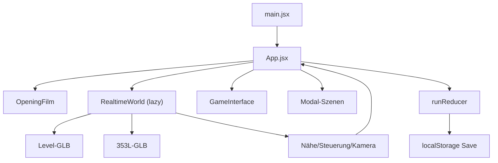

# ISSO.TV V3 — Architektur und Erweiterungspunkte

## Runtime-Fluss



`App.jsx` hält die Verbindung zwischen UI, 3D-Szene und Zustand. Die Welt meldet nur räumliche Fakten und Interaktions-IDs; der Reducer entscheidet über Folgen.

## Zustandsmodell

`createRun()` erzeugt aktuell:

```js
{
  version: 2,
  phase: 'mattress' | 'free',
  worldMinutes: 0,
  doorOpen: false,
  cartResolved: false,
  cartStance: null,
  connectionTone: null,
  visited: ['room'],
  events: [],
  lastLine: '...'
}
```

Neue dauerhafte Mechaniken benötigen:

1. einen expliziten Initialwert in `createRun`,
2. reine Reducer-Actions in `runReducer`,
3. Tests für Normalfall, Grenze und Wiederholung,
4. eine Save-Versionsentscheidung in `save.js`,
5. sichtbare Darstellung oder Folge im Spiel.

Kein persistenter Spielwert darf nur in einem React-Komponenten-State leben.

## 3D-Szene

`RealtimeWorld.jsx` lädt zwei Modelle:

- `/models/isso-v3-vertical-slice-v1.glb`
- `/models/353l-master-character-v3.glb`

Das Level besitzt benannte Objekte wie `door_pivot` und `cart_root`. Der Charakter besitzt benannte Rig-Bones (`rig_arm_l`, `rig_leg_l`, `rig_head` usw.). Änderungen an Blender-Namen sind API-Änderungen und müssen gemeinsam mit der Runtime angepasst werden.

Aktuelle Bewegungszonen:

- Wohnung: `x < 4.25`
- Flur: `4.25 <= x < 10.7`
- Außenwelt: `x >= 10.7`

Diese Werte sind Übergangscode. Phase 1 ersetzt sie durch nachvollziehbare Collider/Nav-Daten.

## Kanonische Daten

`src/game/canon.js` soll langfristig die einzige Quelle für Orte, Interaktionspunkte, Radius, Labels und Kartenpositionen sein. Aktuell dupliziert `RealtimeWorld.jsx` einige 3D-Punkte in `targets`; Arbeitspaket `P1-03` entfernt diese Doppelung.

Neue Storytexte gehören nach Funktion:

- kurze räumliche Labels/Kanon: `canon.js`,
- Zustandsfolgen: `state.js`,
- längere Szenendialoge: später datengetrieben unter `src/content/`,
- Welt-/Tonregeln: `STORY_BIBLE.md`.

## Asset-Pipeline

| Zweck | Quelle | Runtime-Ausgabe |
| --- | --- | --- |
| Welt | `assets/source/isso-v3-vertical-slice-v1.blend` | `public/models/isso-v3-vertical-slice-v1.glb` |
| 353L | `assets/source/353l-master-character-v3.blend` | `public/models/353l-master-character-v3.glb` |
| Konzepte | `assets/concept/` | nicht automatisch ausgeliefert |

Welt neu erzeugen:

```text
blender --background --python tools/blender/build_vertical_slice.py -- <repo-root>
```

Der Character-Builder erwartet zusätzlich ein lokal erzeugtes OBJ-Verzeichnis mit `texture.png`:

```text
blender --background --python tools/blender/build_master_character.py -- <source.obj> <repo-root>
```

Vor einem Asset-Commit prüfen:

- korrekte Achsen, Bodenhöhe und Maßstab,
- stabile Objekt-/Bone-Namen,
- keine fehlenden externen Texturen,
- Polygon-, Material- und Texturkosten,
- Sichtprüfung frontal, seitlich, hinten und in Bewegung,
- Ladezeit und Browserkonsole.

## Erweiterungsstrategie

- Ein neues Gebiet beginnt als kleiner abgeschlossener 3D-Spielpfad mit mindestens einer Entscheidung und sichtbarer Folge.
- NPCs werden zunächst als wenige wiederkehrende Figuren mit Gedächtnis gebaut, nicht als anonyme Menge.
- Wirtschaft wird als reine Domänenlogik mit deterministisch testbarer Simulation integriert, bevor UI/3D hinzukommen.
- Online-Kurse erhalten Cache, Timeout und Offline-Fallback; Saves speichern keine externen Rohantworten.
- Audio, Untertitel, Controller und Touch gelten als Teil des Features, nicht als spätere Dekoration.

## Dialog-, Voice- und Lip-Sync-Pipeline

Die verbindliche Spezifikation steht in `docs/VOICE_AND_LIPSYNC.md`.

- Dialogzustand speichert stabile IDs statt lokalisierter Sätze.
- Langfristige Inhalte liegen datengetrieben unter `src/content/dialogue/`.
- Audio, Untertitel und Viseme referenzieren dieselbe ID.
- Tier-Viseme werden auf artspezifische Shape Keys/Bones gemappt; Performance-Layer für Ohren/Blick/Gesten bleibt getrennt.
- Fehlendes Audio/Viseme fällt auf Untertitel bzw. ruhige Kieferbewegung zurück und blockiert den Run nicht.
- Sprachassets werden szenenweise lazy geladen und getrennt von Musik/Effekten geregelt.

## Architekturentscheidungen

Neue dauerhafte Entscheidungen in `docs/DECISIONS.md` eintragen: Datum, Entscheidung, Grund, Alternativen, Folgen. Große Framework-Wechsel brauchen vor Implementierung eine eigene Entscheidung und einen messbaren Nutzen.
