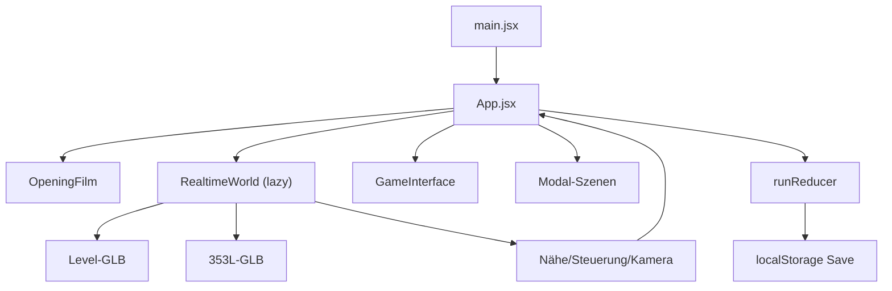

# ISSO.TV V3 — Architektur und Erweiterungspunkte

## Runtime-Fluss



`App.jsx` hält die Verbindung zwischen UI, 3D-Szene und Zustand. Die Welt meldet nur räumliche Fakten und Interaktions-IDs; der Reducer entscheidet über Folgen. Reine Raum-/Tür-/Flurgrenzen und Ortszuordnung liegen testbar in `src/game/movement.js`.

## Zustandsmodell

`createRun()` erzeugt aktuell:

```js
{
  version: 2,
  phase: 'mattress' | 'free',
  worldMinutes: 0,
  doorOpen: false,
  cartResolved: false,
  cartStance: null,
  connectionTone: null,
  visited: ['room'],
  events: [],
  lastLine: '...'
}
```

Neue dauerhafte Mechaniken benötigen:

1. einen expliziten Initialwert in `createRun`,
2. reine Reducer-Actions in `runReducer`,
3. Tests für Normalfall, Grenze und Wiederholung,
4. eine Save-Versionsentscheidung in `save.js`,
5. sichtbare Darstellung oder Folge im Spiel.

Kein persistenter Spielwert darf nur in einem React-Komponenten-State leben.

Kamera-/Grafikoptionen sind kein Run-Fortschritt und liegen daher getrennt unter `isso-tv-v3-settings-v1`. `settings.js` normalisiert Kameratempo auf `0.35..1.4` und akzeptiert nur `auto`, `high` oder `efficient`; beschädigte Daten fallen auf sichere Defaults zurück. Das Optionsfenster ändert `OrbitControls.rotateSpeed`, Canvas-DPR und den Einsatz von `AdaptiveDpr` unmittelbar.

## 3D-Szene

`RealtimeWorld.jsx` lädt zwei Modelle:

- `/models/isso-v3-vertical-slice-v1.glb`
- `/models/353l-hi3d-character-v5.glb`

Das Level besitzt benannte Objekte wie `door_pivot` und `cart_root`. Der Charakter besitzt benannte Rig-Bones (`rig_arm_l`, `rig_leg_l`, `rig_head` usw.). Änderungen an Blender-Namen sind API-Änderungen und müssen gemeinsam mit der Runtime angepasst werden.

Semantische Kamera-/Audiozonen:

- Wohnung: `x < 4.25`
- Flur: `4.25 <= x < 10.7`
- Außenwelt: `x >= 10.7`

Die x-Werte wählen nur Atmosphäre, Kameraabstand und Audiozone. Physische Bewegung wird nicht mehr an diesen Grenzen gekappt: `collectNavigationGeometry()` sammelt benannte Blocker und begehbare Meshes aus dem exportierten Level, `resolveMovement()` löst eine Capsule-ähnliche Bewegung mit Gleiten auf und `groundMovement()` hält 353L per Raycast auf dem Boden. Die Wohnungstür wird als zustandsabhängiger Blocker behandelt. Dieselben Daten sind die Grundlage für spätere NPC-Wege und Verkehr.

Die Orbit-Kamera besitzt keinen künstlichen Azimutstopp und erlaubt 360° Rundumblick. Zonenpresets wählen nur geeignete Abstände für Zimmer, Flur/Vordach und Hafen. Ein Raycast vom Ziel zur gewünschten Kameraposition zieht die Linse automatisch vor tatsächliche Weltgeometrie und verhindert das beobachtete Schneiden durch Hauptwände, Decke und Möbel. Für lokale Sichtprüfung existieren ausschließlich im Vite-Entwicklungsmodus `?preview=room`, `?preview=hall`, `?preview=threshold`, `?preview=awning`, `?preview=harbor` und `?preview=kiosk`; Produktionsstarts ignorieren diese Parameter.

## Kanonische Daten

`src/game/canon.js` ist die einzige Quelle für Weltstart, Orte, Interaktionspunkte, Radien, Labels und Kartenpositionen. `RealtimeWorld.jsx` leitet Ziele, Vorschau-Starts, Lichter und Idle-Fokuspunkte daraus ab; lokale Zahlen sind nur noch ausdrücklich szenische Kamera- oder Spawn-Offsets.

Neue Storytexte gehören nach Funktion:

- kurze räumliche Labels/Kanon: `canon.js`,
- Zustandsfolgen: `state.js`,
- längere Szenendialoge: später datengetrieben unter `src/content/`,
- Welt-/Tonregeln: `STORY_BIBLE.md`.

## Asset-Pipeline

| Zweck | Quelle | Runtime-Ausgabe |
| --- | --- | --- |
| Welt | `assets/source/isso-v3-vertical-slice-v1.blend` | `public/models/isso-v3-vertical-slice-v1.glb` |
| 353L | `assets/source/353l-hi3d-character-v5.blend` | `public/models/353l-hi3d-character-v5.glb` |
| Konzepte | `assets/concept/` | nicht automatisch ausgeliefert |
| Oberflächenmaster | `assets/textures/*-hd-v1.png` | nicht in GLB eingebettet |
| Oberflächenruntime | lokale Pipeline-Derivate | als KTX2/UASTC im Welt-GLB eingebettet |

Welt neu erzeugen:

```text
blender --background --python tools/blender/build_vertical_slice.py -- <repo-root>
```

Der aktuelle Character-Builder erwartet die vom Nutzer bereitgestellte Hi3D-GLB und schreibt zusätzlich einen Buildbericht mit Hash, Rechtehinweis und Budgets:

```text
blender --background --python tools/blender/build_hi3d_character.py -- <source.glb> <repo-root>
```

Der V5-Export normalisiert auf 2,15 m und reduziert zwei Millionen auf 120.000 Laufzeitdreiecke. Er bewahrt die vom Nutzer abgenommene Quellanatomie vollständig: fellbedeckte greiffähige Vorderhufe mit Keratinspitzen, feste equine Hinterhufe und Schwanz bleiben Teil des einen geskinnten Körpermeshes. Eingebettete 8K-Bilder werden auf höchstens 2K skaliert; die stabile `rig_*`-API und `slot_*`-Anker bleiben erhalten. Der Builder erzeugt verbessertes Mehrgelenk-Weighting, Gesichtsbones und elf Clips. Das lokale, über `.gitignore` ausgeschlossene Original liegt als `assets/source/353l-hi3d-character-v5-original.glb`; sein SHA-256 steht im Buildbericht. `src/game/characterAsset.test.js` schützt Dateibudget, V5-Metadaten, Gelenke, Clips, Kompression, LODs und Slots.

`npm run assets:runtime` führt anschließend KTX2/UASTC-Texturwandlung, Meshopt-Kompression und die LOD-Ausgaben aus. Blender-Draco bleibt der reproduzierbare Geometrie-Zwischenschritt; die Browser-Runtime lädt Meshopt und KTX2 über lokale Decoder unter `public/draco/` und `public/basis/`. Der vollständige Ablauf steht in `docs/ASSET_PIPELINE.md`.

Lokale deutsche KI-Vorschauzeilen aus dem kanonischen Dialog-JSON neu erzeugen:

```text
python tools/audio/generate_voice_preview.py
```

Das benötigt das lokale Python-Paket `edge-tts` und Netzwerkzugang. Erzeugte Dateien bleiben bis zur Rechteprüfung Vorschauassets und dürfen nicht automatisch veröffentlicht werden.

Vor einem Asset-Commit prüfen:

- korrekte Achsen, Bodenhöhe und Maßstab,
- stabile Objekt-/Bone-Namen,
- keine fehlenden externen Texturen,
- Polygon-, Material- und Texturkosten,
- Sichtprüfung frontal, seitlich, hinten und in Bewegung,
- Ladezeit und Browserkonsole.

Der Hafen nutzt zusätzlich zwei kleine Runtime-Shader in `RealtimeWorld.jsx`: `HarborWater` animiert die Wasserfläche ohne Texturdownload, `WetPatches` ersetzt opake Pfützengeometrie durch weich auslaufende Reflexionsflächen. Die Blender-Objekte `harbor_water` und `puddle_*` bleiben als editierbare Platzhalter/Koordinatenanker im Level, werden zur Laufzeit aber ausgeblendet.

Arbeitsschiff und ferne Speicherstadt sind echte 3D-Geometrie derselben Weltdatei. Sie liegen außerhalb des spielbaren Piers, erzeugen Parallaxe und verschwinden kontrolliert im Laufzeitnebel. Fenster-Serien werden gebatcht; Schiffsteile bleiben einzeln benannt, damit spätere Animation, Licht und Hafeninteraktion ohne Neuaufbau möglich sind.

Der Hufsprint kombiniert den authored Run-/Tierlauf-Übergang mit der prozeduralen Geschwindigkeits- und Stabilitätsschicht: Shift hebt die Zielgeschwindigkeit von `3.05` auf `6.15`, blendet die Vorwärtsneigung ein und erweitert den Perspektivwinkel weich um maximal 4,5 Grad. Ein gait-synchroner Foot-Lock korrigiert die Pflanzphase; ein späterer Mocap-/Cinematic-Pass und ein Ausdauer-/Impulssystem bleiben Qualitätsausbau.

`WorldErrorBoundary` umschließt die gesamte Canvas-Runtime. Fehler beim Laden oder Rendern führen zu einem eigenen Vollbildzustand mit Reload-Aktion; der Save liegt außerhalb dieser Komponente und bleibt erhalten. `LoadingModel` verwendet `useProgress()` für Prozent und Bausteinzähler. `?force3dError=1` erzwingt den Fallback ausschließlich im Vite-Entwicklungsmodus und dient der visuellen Regression, nicht dem Gameplay.

`useVoicePlayer()` besitzt neben Sprachwiedergabe und Analyser ein prozedurales Ambientebett im selben `AudioContext`: gelooptes gefiltertes Brown-Noise für Regen sowie einen sehr leisen 48-Hz-Raumton. `setAmbienceZone()` fährt Gain-Ziele weich für `room`, `hallway`, `awning`, `harbor`, `station` und `signalwerk`. Master, Sprache, Atmosphäre und Effekte sind getrennte Busse; der zentrale Ton-Schalter blendet den Master-Gain und stoppt weiterhin laufende Sprache. Die Quellen werden genau einmal gestartet und beim Unmount beendet.

`RealtimeWorld` zählt Gait-Halbzyklen und meldet nur neue Kontakte über `onFootstep(zone, intensity)`. `playFootstep()` erzeugt daraus zwei kurze Hüllkurven (tiefer Hufkörper plus leiser Klick), verbindet sie mit demselben Ambientemaster und trennt die Nodes nach dem Ausklang. Ohne laufenden/entsperrten `AudioContext` oder bei `TON AUS` ist der Aufruf wirkungslos.

`playWorldCue()` nutzt dieselbe sichere Einmal-Node-Strategie für semantische Interaktionen. Die Cue-Namen `door`, `connection`, `cart`, `station` und `signalwerk` sind die aktuelle Audio-API zwischen `App.jsx` und dem Soundgraph; unbekannte Namen bleiben lautlos. Ein Cue ändert keinen Spielzustand und darf eine Reducer-Action nie ersetzen.

`DockWorker` klont vorläufig dasselbe geriggte Quellmodell wie 353L, erzeugt jedoch eigene Materialinstanzen und einen eigenen Maßstab; dadurch darf seine kühlere Tönung den Spieler niemals mitverändern. Warnweste, Reflexring und Schutzhelm sind zusätzliche echte Three-Meshes. Nur das Kopfrig reagiert derzeit auf `run.cartResolved`; ein späteres individuelles NPC-Asset kann die Komponente ersetzen, ohne die Wagenlogik zu ändern.

`merge_static()` im Welt-Builder darf ausschließlich wiederholte, nicht interaktive Details zusammenführen. Vor dem Join werden Bevel-Modifier fest angewendet; Interaktionsroots, Türen, Wagen, Rigobjekte und semantische Ortsanker bleiben einzeln und namentlich stabil. Der aktuelle Build batcht unter anderem Ziegel, Dielen, Abflussgitter, Container-/Vordachrippen und Heizkörperlamellen.

Der zweite statische Pass bündelt zusätzlich ferne Speicherblöcke, Dachlinien, Schornsteine, Schiffreling, Hafenleuchten, Bollards sowie Kranbeine/-querträger/-seile. In der Runtime ist `detailedCaster` absichtlich auf den spielnahen Vordergrund begrenzt; entfernte Skyline-, Schiff-, Kran- und Containerobjekte empfangen weiterhin Licht und Nebel, vervielfachen aber nicht den Directional-Shadow-Pass.

`text_mesh()` erzeugt Weg- und Gebäudeschrift als konvertierte Mesh-Geometrie. Die lokale X-Spiegelung vor dem Export kompensiert die glTF-Achsentransformation, damit die Frontseite im Browser nicht spiegelverkehrt erscheint. Schilder bleiben bewusst einzeln benannt und werden nicht mit statischen Fassadenbatches zusammengeführt.

## Erweiterungsstrategie

- Ein neues Gebiet beginnt als kleiner abgeschlossener 3D-Spielpfad mit mindestens einer Entscheidung und sichtbarer Folge.
- NPCs werden zunächst als wenige wiederkehrende Figuren mit Gedächtnis gebaut, nicht als anonyme Menge.
- Wirtschaft wird als reine Domänenlogik mit deterministisch testbarer Simulation integriert, bevor UI/3D hinzukommen.
- Online-Kurse erhalten Cache, Timeout und Offline-Fallback; Saves speichern keine externen Rohantworten.
- Audio, Untertitel, Controller und Touch gelten als Teil des Features, nicht als spätere Dekoration.

## Dialog-, Voice- und Lip-Sync-Pipeline

Die verbindliche Spezifikation steht in `docs/VOICE_AND_LIPSYNC.md`.

- Dialogzustand speichert stabile IDs statt lokalisierter Sätze.
- Langfristige Inhalte liegen datengetrieben unter `src/content/dialogue/`.
- Audio, Untertitel und Viseme referenzieren dieselbe ID.
- Tier-Viseme werden auf artspezifische Shape Keys/Bones gemappt; Performance-Layer für Ohren/Blick/Gesten bleibt getrennt.
- Fehlendes Audio/Viseme fällt auf Untertitel bzw. ruhige Kieferbewegung zurück und blockiert den Run nicht.
- Sprachassets werden szenenweise lazy geladen und getrennt von Musik/Effekten geregelt.
- Der aktuelle Slice liest den Pegel über Web Audio und schreibt ihn in ein Ref; der 3D-Renderloop liest dieses Ref ohne React-Rerender pro Audioblock.

## Architekturentscheidungen

Neue dauerhafte Entscheidungen in `docs/DECISIONS.md` eintragen: Datum, Entscheidung, Grund, Alternativen, Folgen. Große Framework-Wechsel brauchen vor Implementierung eine eigene Entscheidung und einen messbaren Nutzen.
